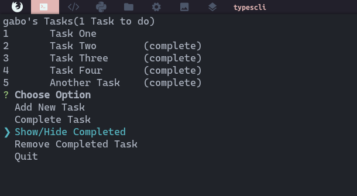
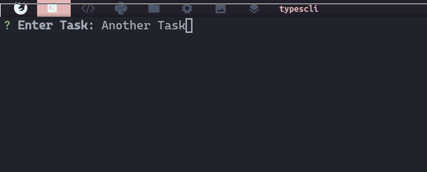
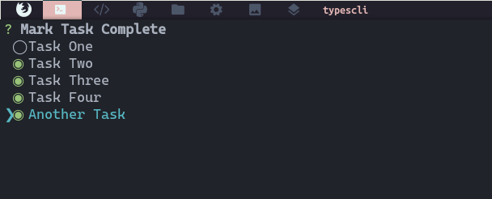
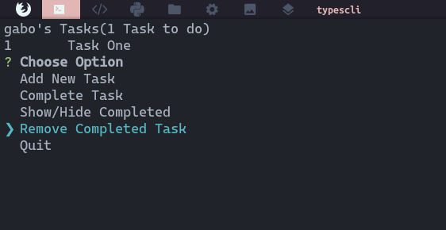

# TYPESCLI :rocket:

This is a cli app that can create, mark as complete, show/hide completed and remove tasks.

## Technologies used for this project :computer:

- [typescript](https://www.typescriptlang.org/)
- [nodejs](https://nodejs.org/en/)
- [lowdb](https://www.npmjs.com/package/lowdb)
- [inquirer](https://www.npmjs.com/package/inquirer)

## Usage

> [npm](https://www.npmjs.org) is required.

```cmd
npm i typescli -g
typescli 
```

## Screenshots :camera:

#### Show/Hide Completed Tasks


#### Add New Tasks


#### Mark Tasks as Completed


#### Remove Completed Task


## Hacking

> You can modified source code.

```cmd
git clone https://github.com/gabrielba15/typescli.git 
cd typescli
npm install 
npm run build 
npm start
```

> Ready, happy hacking :D
